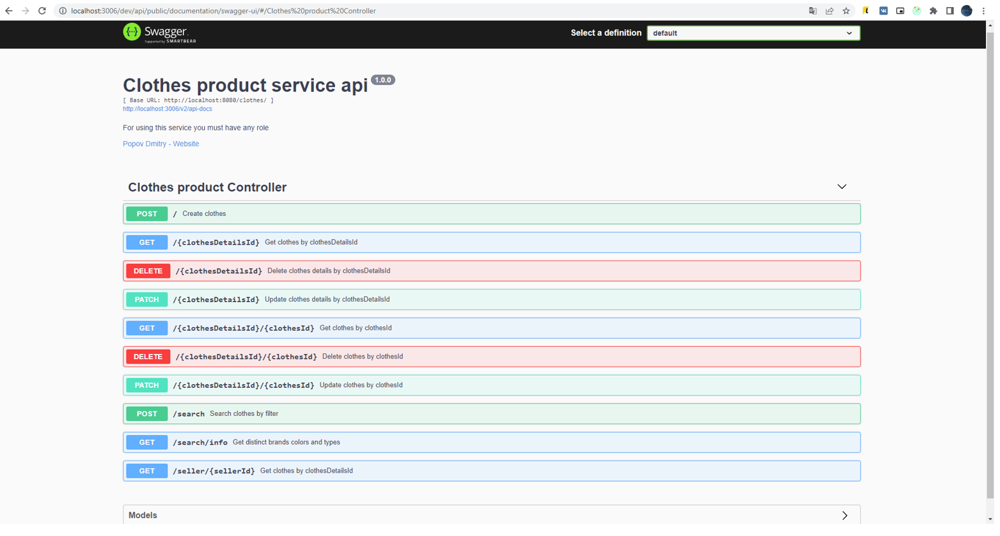
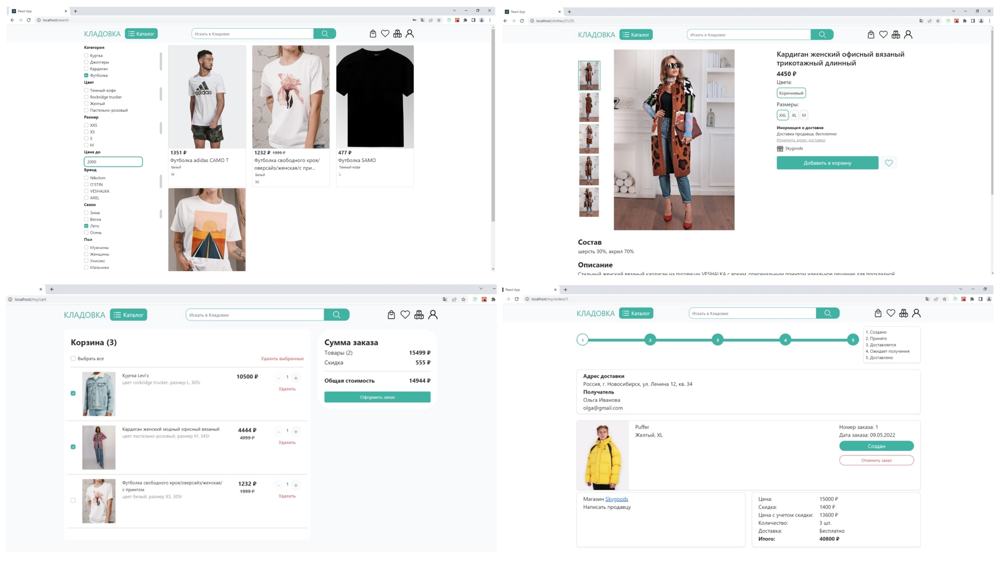

# Marketplace "Kladovka"

In this project, were developed and tested client and server applications of the marketplace, where users can buy and sell goods via the Internet. Due to the presence of a large number of sellers, the customer will be able to choose all the necessary goods in one place. And sellers will be able to increase sales of their goods.

## Used technologies

Backend:
- [JDK 17](https://www.oracle.com/java/technologies/javase/jdk17-archive-downloads.html)
- [Apache Maven](https://maven.apache.org/)
- [Spring Boot](https://spring.io/projects/spring-boot)
- - [Eureka Server](https://spring.io/projects/spring-cloud-netflix)
- - [Zuul Proxy Server](https://cloud.spring.io/spring-cloud-netflix/multi/multi__router_and_filter_zuul.html)
- - [Spring Data Jpa](https://spring.io/projects/spring-data-jpa)
- - [Spring Security](https://spring.io/projects/spring-security)
- - [Spring Cloud Config](https://spring.io/projects/spring-cloud-config)
- - [Spring Cloud OpenFeign](https://spring.io/projects/spring-cloud-openfeign)
- - [Spring Testing](https://docs.spring.io/spring-framework/docs/current/reference/html/testing.html)
- [Lombok](https://projectlombok.org/)
- [SL4J](https://www.slf4j.org/)
- [Logback](https://logback.qos.ch/)
- [Apache Kafka](https://kafka.apache.org/)
- [PostgreSQL](https://www.postgresql.org/)
- [Redis](https://redis.io/)
- [Swagger](https://swagger.io/)

Frontend:
- HTML5, CSS3, JS, [Bootstrap](https://getbootstrap.com/)
- [React](https://reactjs.org/)
- [Redux](https://redux.js.org/)
- [Redux-saga](https://redux-saga.js.org/)
- [Axios](https://axios-http.com/)
- [Jest](https://jestjs.io/)
- [Russian Post API](https://delivery.pochta.ru/)

## System architecture

System architecture includes 4 parts:
1. Client application server
2. Application server
3. Database servers
4. Message broker server

## Backend

In the current version of the system, 15 microservices has developed. The first 3 of them are utility services, the rest were allocated according to their business objectives:
1. Discovery service – is a service based on Eureka Server.
2. Configuration service - a service that provides configuration files to other microservices. When starting, other services need to know the address of this service in order to request configuration files.
3. Gateway service - is a common entry point based on Zuul Proxy Server. Here, requests are routed to the necessary microservices, unauthorized requests are filtered, and access rights to endpoints are configured.
4. Admin service - a service for working with administrators. Contains endpoints for CRUD (create, read, update, delete) operations with administrators. Only users with the administrator role have access to the service.
5. Auth service - in this service, users are authenticated. To compare the entered data with those stored in the database, the service sends HTTP requests using the Feign client to other services corresponding to the user's role. In case of successful authentication, the service returns a jwt authorization token in the Authorization HTTP header.
6. Cart service - a service for working with baskets of goods of customers. Contains endpoints for CRUD cart operations. Only users with the customer and administrator roles have access to the service.
7. Clothes product service - a service for working with goods from the "clothes" category. Contains endpoints for CRUD operations with products from this category. Access to the service with data modification operations (POST, PATCH, DELETE requests) is available only to users with the role of seller and administrator, any, even unauthorized users, can receive data (GET request).
8. Customer service - a service for working with customers. Contains endpoints for CRUD operations with customers. Depending on the operation, users with the role of customer, seller, and administrator can access the service.
9. Delivery service - a service for working with the delivery addresses of customers, as well as the delivery of sellers. Contains endpoints for CRUD operations with customers' addresses and CRU operations with sellers' delivery options. Depending on the operation, users with the role of customer, seller, and administrator can access the service.
10. Moder service - a service for working with moderators. Contains endpoints for CRUD operations with moderators. Only users with the role of moderator and administrator have access to the service, and only an administrator can add a new user (POST method).
11. Order service - a service for working with orders for goods. Contains endpoints for CRU operations with orders, as well as endpoints for CR operations with order returns. Depending on the operation, users with the role of customer, seller, and administrator can access the service.
12. Photo service - a service for working with product images. Contains endpoints for CRD image operations. Only users with the seller and administrator roles can upload and delete (POST and DELETE methods) images in the service, and any users can receive images (GET method).
13. Seller service - a service for working with sellers. Contains endpoints for CRUD operations with sellers. Depending on the operation, users with the role of customer, seller and administrator or unauthorized users can access the service during registration (POST method).
14. Verification service - a service for verifying sellers. Serves for the moderator to check the data specified by the seller during registration. Contains endpoints for CR operations with seller verification information. Only users with moderator and administrator roles can access the service.
15. Wishlist service - a service for working with lists of desired goods for customers. Contains endpoints for CRUD operations on wishlists. Access to the service with data modification operations (POST, PATCH, DELETE requests) is available only to users with the customer and administrator roles; users with the seller role can also receive data (GET request).

## Example of a typical configuration file

The configuration files are stored in the GitHub repository in the configs folder. The name of the configuration file must match the name of the service.
The file contains the following properties:
- eureka.client.serviceUrl.defaultZone – Eureka Server url;
- server.port – port on which the server will run;
- spring.datasource.url – DB url;
- spring.datasource.driver-class-name – DB driver;
- spring.datasource.username – DB username;
- spring.datasource.password – DB password;
- springfox.documentation.swagger-ui.base-url – base url where documentation in Swagger format is available in the browser;
- documentation.base-url – url of the service, which will be indicated in the documentation;
- kafka.bootstrap-servers – Kafka Server url;
- kafka.consumer-group.moderated-seller – Kafka consumer group name;
- kafka.topic.producer.seller-topic – Kafka producer topic name;
- kafka.topic.consumer.moderated-seller-topic – Kafka consumer topic name.

## API Documentation

The documentation for the developed API was generated using Swagger and is available at the url {service-url}/dev/api/public/documentation/swagger-ui/

## Frontend

The site is divided into 4 subdomains: the buyer doesn't have it, the seller has seller, the moderator has moder, and the administrator has admin. Depending on the subdomain, available routes are determined and the navigation bar is render. Also, the available routes are determined depending on the authorization of the user. Not all routes are available to unauthorized users.
At this stage of development, there are 21 routes on the site. Some of the same routes render different pages on different subdomains.

Customer routes accessible without authorization:
- / – main page;
- /catalog – catalog;
- /clothes – goods category clothes;
- /clothes/{detailsId}/{id} – product page.

Customer routes available with authorization (including those mentioned above):
- /account – user account page;
- /account/personal – user personal settings;
- /account/security – security settings;
- /account/addresses – shipping address settings;
- /my/cart – cart page;
- /my/orders – order list;
- /my/orders/{id} – order page;
- /my/wishlist – wish list.

Seller routes available without authorization:
- / – main page;
- /registration – registration page;
- /login – authorization page.

Seller routes available with authorization (including those mentioned above):
- /account – user account page;
- /account/personal – user personal settings;
- /account/security – security settings;
- /my/delivery – list of delivery options;
- /my/shop – store information page;
- /my/products – product list;
- /my/products/new – product adding form;
- /my/products/{detailsId}/edit – form for editing general information about products;
- /my/products/{detailsId}/{id}/edit – form for editing information about a product variant;
- /my/products/{detailsId}/new – form adding a new product variant.

Moderator route available without authorization:
- /login – authorization page.

Moderator routes available with authorization:
- / – main page;
- /account – user account page;
- /account/personal – user personal settings;
- /account/security – security settings;
- /verification – list of sellers for verification;
- /verification/{id} – seller verification page.

User interface examples:

