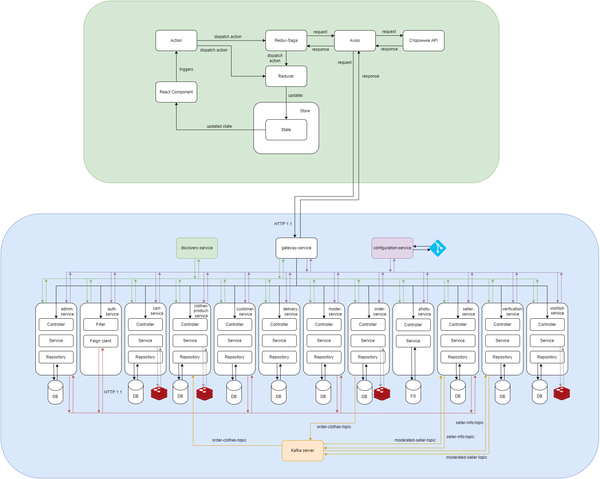
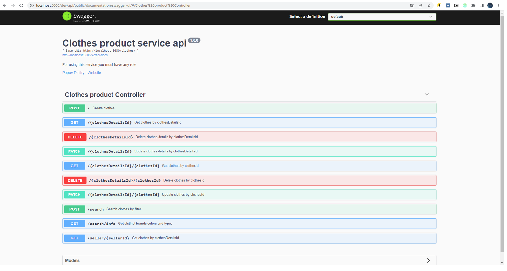
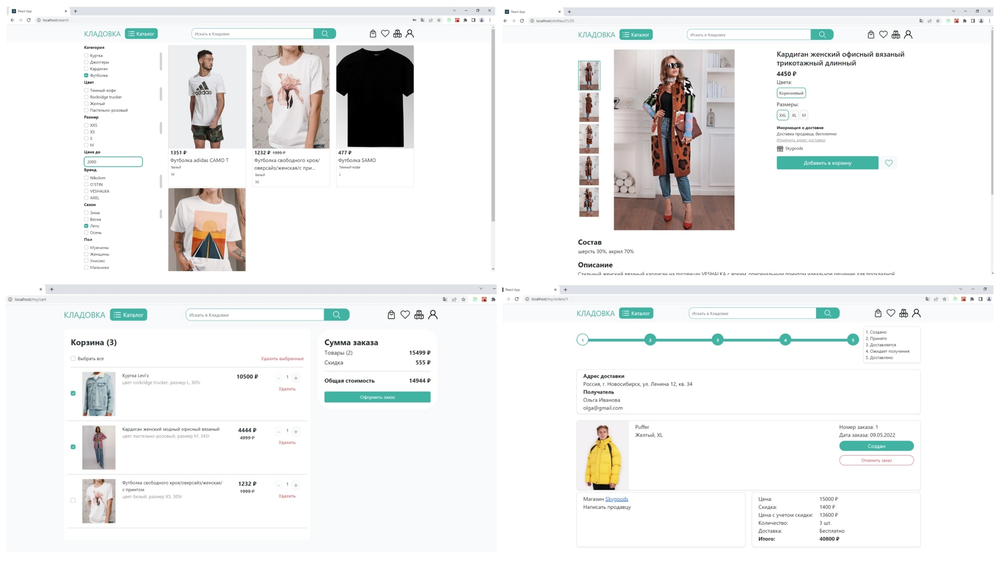

# Маркетплейс "Кладовка"

В данном проекте были разработаны и протестированы клиентское и серверные приложения маркетплейса, на котором пользователи смогут покупать и продавать товары через Интернет. Благодаря наличию большого количества продавцов, покупатель сможет выбрать все необходимые товары в одном месте. А продавцы смогут увеличить продажи своих товаров.

## Использованные технологии

Серверная часть:
- [JDK 17](https://www.oracle.com/java/technologies/javase/jdk17-archive-downloads.html)
- [Apache Maven](https://maven.apache.org/)
- [Spring Boot](https://spring.io/projects/spring-boot)
- - [Eureka Server](https://spring.io/projects/spring-cloud-netflix)
- - [Zuul Proxy Server](https://cloud.spring.io/spring-cloud-netflix/multi/multi__router_and_filter_zuul.html)
- - [Spring Data Jpa](https://spring.io/projects/spring-data-jpa)
- - [Spring Security](https://spring.io/projects/spring-security)
- - [Spring Cloud Config](https://spring.io/projects/spring-cloud-config)
- - [Spring Cloud OpenFeign](https://spring.io/projects/spring-cloud-openfeign)
- - [Spring Testing](https://docs.spring.io/spring-framework/docs/current/reference/html/testing.html)
- [Lombok](https://projectlombok.org/)
- [SL4J](https://www.slf4j.org/)
- [Logback](https://logback.qos.ch/)
- [Apache Kafka](https://kafka.apache.org/)
- [PostgreSQL](https://www.postgresql.org/)
- [Redis](https://redis.io/)
- [Swagger](https://swagger.io/)

Клиентская часть:
- HTML5, CSS3, JS, [Bootstrap](https://getbootstrap.com/)
- [React](https://reactjs.org/)
- [Redux](https://redux.js.org/)
- [Redux-saga](https://redux-saga.js.org/)
- [Axios](https://axios-http.com/)
- [Jest](https://jestjs.io/)
- [API Почты России](https://delivery.pochta.ru/)

## Архитектура системы

Общая архитектура системы состоит из 4 частей:
1. Сервер клиентского приложения
2. Сервера приложений
3. Сервера баз данных
4. Сервер брокера сообщений

## Серверная часть

В текущей версии системы разработано 15 микросервисов. Первые 3 из них – это служебные сервисы, остальные были выделены согласно своим бизнес-задачам:
1. Discovery service – сервис, основанный на Eureka Server.
2. Configuration service – сервис, предоставляющий конфигурационные файлы другим микросервисам. При старте другим сервисам необходимо знать адрес этого сервиса, чтобы запросить конфигурационные файлы.
3. Gateway service – общая точка входа, основанная на Zuul Proxy Server. Здерь происходит маршрутизация запросов к нужным микросервисам, фильтрация неавторизированных запросов и настройка прав доступа к эндпоинтам.
4. Admin service – сервис для работы с администраторами. Содержит эндпоинты для CRUD (create, read, update, delete) операций с администраторами. Доступ к сервису имеют только пользователи с ролью администратора.
5. Auth service – в данном сервисе происходит аутентификация пользователей. Для сравнения введенных данных с сохраненными в базе данных сервис отправляет HTTP запросы с помощью Feign client к другим сервисам, соответствующим роле пользователя. В случае успешной аутентификации сервис возвращает jwt-токен авторизации в HTTP заголовке Authorization.
6. Cart service – сервис для работы с корзинами товаров покупателей. Содержит эндпоинты для CRUD операций с корзиной. Доступ к сервису имеют только пользователи с ролью покупателя и администратора.
7. Clothes product service – сервис для работы с товарами из категории «одежда». Содержит эндпоинты для CRUD операций с товарами из этой категории. Доступ к сервису с операциями изменения данных (запросы POST, PATCH, DELETE) имеют только пользователи с ролью продавца и администратора, получить данные (запрос GET) могут любые, даже неавторизированные пользователи.
8. Customer service – сервис для работы с покупателями. Содержит эндпоинты для CRUD операций с покупателями. Доступ к сервису в зависимости от операции могут иметь пользователи с ролью покупателя, продавца и администратора.
9. Delivery service – сервис для работы с адресами доставки покупателей, а также доставкой продавцов. Содержит эндпоинты для CRUD операций с адресами покупателей и CRU операций с вариантами доставок продавцов. Доступ к сервису в зависимости от операции могут иметь пользователи с ролью покупателя, продавца и администратора.
10. Moder service – сервис для работы с модераторами. Содержит эндпоинты для CRUD операций с модераторами. Доступ к сервису имеют только пользователи с ролью модератора и администратора, при этом добавить нового пользователя (метод POST) может только администратор.
11. Order service – сервис для работы с заказами товаров. Содержит эндпоинты для CRU операций с заказами, а также эндпоинты для CR операций с возвратами заказов. Доступ к сервису в зависимости от операции могут иметь пользователи с ролью покупателя, продавца и администратора.
12. Photo service – сервис для работы с изображениями товаров. Содержит эндпоинты для CRD операций с изображениями. Загружать и удалять (методы POST и DELETE) изображения в сервисе могут только пользователи с ролью продавца и администратора, а получать изображения (метод GET) могут любые пользователи.
13. Seller service – сервис для работы с продавцами. Содержит эндпоинты для CRUD операций с продавцами. Доступ к сервису в зависимости от операции могут иметь пользователи с ролью покупателя, продавца и администратора или неавторизированные пользователи, при регистрации (метод POST).
14. Verification service – сервис для верификации продавцов. Служит для проверки модератором данных, указанных продавцом при регистрации. Содержит эндпоинты для CR операций с информацией о верификации продавца. Доступ к сервису могут иметь только пользователи с ролью модератора и администратора.
15. Wishlist service – сервис для работы со списками желаемых товаров покупателей. Содержит эндпоинты для CRUD операций со списками желаемых товаров. Доступ к сервису с операциями изменения данных (запросы POST, PATCH, DELETE) имеют только пользователи с ролью покупателя и администратора, получить данные (запрос GET) могут также пользователи с ролью продавца.

## Пример типового файла конфигураций

Конфигурационные файлы хранятся в репозитории на GitHub в папке configs. Название конфигурационного файла должно соответствовать названию сервиса.
Файл содержит следующие свойства:
- eureka.client.serviceUrl.defaultZone – адрес Eureka Server;
- server.port – порт, на котором будет запущен сервер;
- spring.datasource.url – адрес СУБД;
- spring.datasource.driver-class-name – драйвер, необходимый для используемой СУБД;
- spring.datasource.username – имя пользователя СУБД;
- spring.datasource.password – пароль пользователя СУБД;
- springfox.documentation.swagger-ui.base-url – базовый адрес по которому доступна документация в формате Swagger в браузере;
- documentation.base-url – адрес сервиса, который будет указан в документации;
- kafka.bootstrap-servers – адрес Kafka Server;
- kafka.consumer-group.moderated-seller – название Kafka consumer group;
- kafka.topic.producer.seller-topic – название Kafka producer топика;
- kafka.topic.consumer.moderated-seller-topic – название Kafka consumer топика.

## API документация

Документация к разработанному API сформирована с использованием Swagger и доступна по url {service-url}/dev/api/public/documentation/swagger-ui/

## Клиентская чать

Сайт разделен на 4 поддомена: у покупателя его нет, у продавца – seller, у модератора – moder, у администратора – admin. В зависимости от поддомена происходит определение доступных маршрутов и отрисовка навигационной панели. Также доступные маршруты определяются в зависимости от авторизированности пользователя. Неавторизированным пользователям доступны не все маршруты.
На данном этапе разработки на сайте присутствует 21 маршрут. Некоторые одни и те же маршруты приводят на разные страницы при различных поддоменах.

Маршруты покупателя, доступные без авторизации:
- / – главная страница;
- /catalog – каталог товаров;
- /clothes – товары категории одежда;
- /clothes/{detailsId}/{id} – страница товара.

Маршруты покупателя, доступные с авторизацией (включая указанные выше):
- /account – страница аккаунта пользователя;
- /account/personal – настройки личных данных пользователя;
- /account/security – настройки безопасности;
- /account/addresses – настройки адресов доставки;
- /my/cart – страница корзины;
- /my/orders – список заказов;
- /my/orders/{id} – страница заказа;
- /my/wishlist – список желаемых товаров.

Маршруты продавца, доступные без авторизации:
- / – главная страница;
- /registration – страница регистрации;
- /login – страница авторизации.
Маршруты продавца, доступные с авторизацией (включая указанные выше):
- /account – страница аккаунта пользователя;
- /account/personal – настройки личных данных пользователя;
- /account/security – настройки безопасности;
- /my/delivery – список вариантов доставок;
- /my/shop – страница информации о магазине;
- /my/products – список товаров;
- /my/products/new – форма добавления товара;
- /my/products/{detailsId}/edit – форма редактирования общей информации о товарах;
- /my/products/{detailsId}/{id}/edit – форма редактирования информации о варианте товара;
- /my/products/{detailsId}/new – форма добавление нового варианта товара.

Маршрут модератора, доступный без авторизации:
- /login – страница авторизации.

Маршруты модератора, доступные с авторизацией:
- / – главная страница;
- /account – страница аккаунта пользователя;
- /account/personal – настройки личных данных пользователя;
- /account/security – настройки безопасности;
- /verification – список продавцов для верификации;
- /verification/{id} – страница верификации продавца.

Примеры пользовательского интерфейса:

